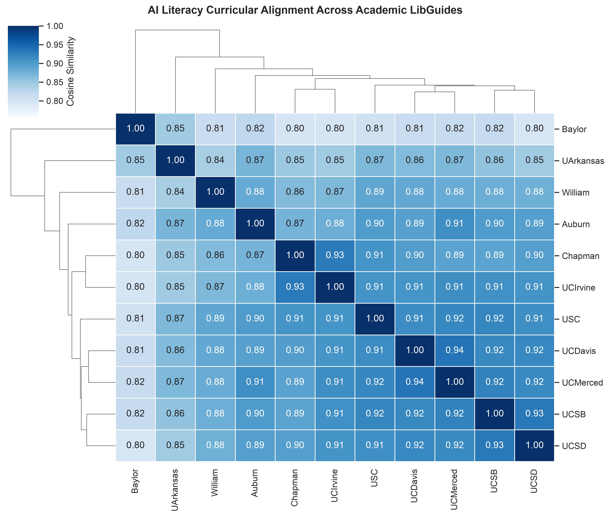

## Semantic Vector Embeddings Methodology

To evaluate curricular alignment mathematically without subjective bias, each institution's extracted profile—incorporating its definitions, named frameworks, student learning outcomes, instructor goals, and policy stances—was embedded into high-dimensional vector representations using `gemini-embedding-2` and verified locally with `nomic-embed-text`.

Pairwise Cosine Similarity was computed across all 11 institutions to construct the similarity matrix and hierarchical clustermap:

$$\text{Cosine Similarity}(\mathbf{u}, \mathbf{v}) = \frac{\mathbf{u} \cdot \mathbf{v}}{\|\mathbf{u}\|_2 \|\mathbf{v}\|_2}$$

---

## Clustered Heatmap Visualization

The hierarchical clustermap below groups institutions by their curricular similarity:

::: {.text-center}
{width=85% .border .rounded .shadow}
:::

---

## Pairwise Cosine Similarity Matrix

| Institution | Auburn | Baylor | Chapman | UArkansas | UCDavis | UCIrvine | UCMerced | UCSB | UCSD | USC | William |
| :--- | :---: | :---: | :---: | :---: | :---: | :---: | :---: | :---: | :---: | :---: | :---: |
| **Auburn** | **1.000** | 0.842 | 0.945 | 0.835 | 0.941 | 0.852 | 0.940 | 0.944 | 0.928 | 0.923 | 0.934 |
| **Baylor** | 0.842 | **1.000** | 0.856 | **0.942** | 0.875 | 0.812 | 0.848 | 0.860 | 0.847 | 0.840 | 0.851 |
| **Chapman** | 0.945 | 0.856 | **1.000** | 0.841 | 0.938 | 0.868 | 0.943 | 0.942 | 0.928 | 0.926 | 0.934 |
| **UArkansas** | 0.835 | **0.942** | 0.841 | **1.000** | 0.873 | 0.810 | 0.842 | 0.856 | 0.844 | 0.838 | 0.849 |
| **UCDavis** | 0.941 | 0.875 | 0.938 | 0.873 | **1.000** | 0.885 | **0.964** | **0.961** | **0.961** | 0.939 | 0.940 |
| **UCIrvine** | 0.852 | 0.812 | 0.868 | 0.810 | 0.885 | **1.000** | 0.874 | 0.878 | 0.862 | 0.860 | 0.864 |
| **UCMerced** | 0.940 | 0.848 | 0.943 | 0.842 | **0.964** | 0.874 | **1.000** | **0.952** | 0.938 | 0.936 | 0.934 |
| **UCSB** | 0.944 | 0.860 | 0.942 | 0.856 | **0.961** | 0.878 | **0.952** | **1.000** | **0.969** | **0.949** | 0.942 |
| **UCSD** | 0.928 | 0.847 | 0.928 | 0.844 | **0.961** | 0.862 | 0.938 | **0.969** | **1.000** | 0.944 | 0.932 |
| **USC** | 0.923 | 0.840 | 0.926 | 0.838 | 0.939 | 0.860 | 0.936 | **0.949** | 0.944 | **1.000** | 0.931 |
| **William & Mary**| 0.934 | 0.851 | 0.934 | 0.849 | 0.940 | 0.864 | 0.934 | 0.942 | 0.932 | 0.931 | **1.000** |

---

## Detailed Cluster & Outlier Interpretation

Mathematical clustering reveals three distinct institutional groupings and one pedagogical outlier:

```{mermaid}
%%| fig-cap: "Institutional Alignment and Curricular Networks"
%%{init: {'themeVariables': {'fontSize': '14px'}}}%%
flowchart TD
    ALL["AI Literacy Curricular Clusters"]

    ALL --> UC["UC Core Network - Sim over 0.95"]
    ALL --> TD["Pragmatic Tool Dyad - Sim 0.942"]
    ALL --> CO["Critical Theory Focus - Outlier"]
    ALL --> DH["Demystification and Habits - Sim 0.93 to 0.95"]

    UC --> U1["UC Davis"]
    UC --> U2["UC Merced"]
    UC --> U3["UC Santa Barbara"]
    UC --> U4["UC San Diego"]
    UC --> U5["USC (0.949)"]

    TD --> T1["Baylor University"]
    TD --> T2["University of Arkansas"]

    CO --> C1["UC Irvine"]

    DH --> D1["Auburn University"]
    DH --> D2["Chapman University"]
    DH --> D3["William and Mary"]
```

### 1. The University of California Core Network
- **Institutions**: UC Davis, UC Merced, UC Santa Barbara, UC San Diego, with USC closely adjacent.
- **Pairwise Affinity**: **0.952 to 0.969** (highest pairwise affinity in the corpus is UCSB $\leftrightarrow$ UCSD at **0.9694**).
- **Underlying Rationale**: These guides exhibit shared pedagogical structures: multi-parameter prompt design rubrics (CLEAR, RTF, TAG), standardized citation requirements across style guides, campus data security tiers (P2/P4 data protection), and active coordination on authentic assessment design.

### 2. The Pragmatic Tool-Use Dyad
- **Institutions**: Baylor University $\leftrightarrow$ University of Arkansas.
- **Pairwise Affinity**: **0.9422** similarity with each other, but isolated from the rest of the corpus (similarities to other institutions drop below **0.87**).
- **Underlying Rationale**: Both guides prioritize the mechanics of research and discovery tools—natural language database querying, RAG summaries in EBSCO/OneSearch, and data mining scripts—focusing on practical user workflows rather than theoretical or sociotechnical critiques.

### 3. The Critical Theory Outlier: UC Irvine
- **Institution**: UC Irvine.
- **Maximum Similarity**: **0.8848** (to UC Davis) and **0.8780** (to UCSB).
- **Underlying Rationale**: While other UC campuses balance tool optimization with critical evaluation, UC Irvine structures its guide primarily around **Critical Information Literacy (CIL)** and the ACRL Framework. The guide focuses heavily on algorithmic bias, data worker labor exploitation in the global South, and environmental footprints, de-emphasizing utilitarian prompt-engineering guides.

### 4. Demystification & Cognitive Preserving Cluster
- **Institutions**: Auburn University, Chapman University, William & Mary.
- **Pairwise Affinity**: **0.9338 – 0.9452**.
- **Underlying Rationale**: These institutions emphasize demystifying AI concepts for non-programmers, preventing cognitive offloading ("Against Brain Damage"), and implementing accessible evaluation rubrics (the ROBOT Test).

---

[← Previous: 5. Instructional Frameworks](05-frameworks.qmd){.btn .btn-outline-secondary}
[Next: 7. Strategic Recommendations →](07-recommendations.qmd){.btn .btn-primary}
